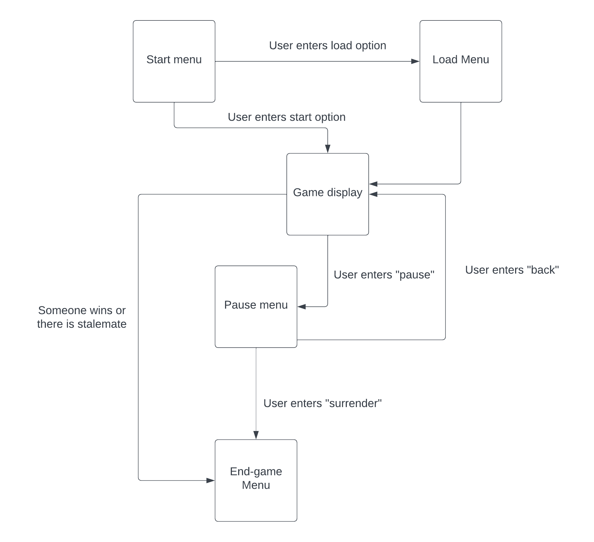
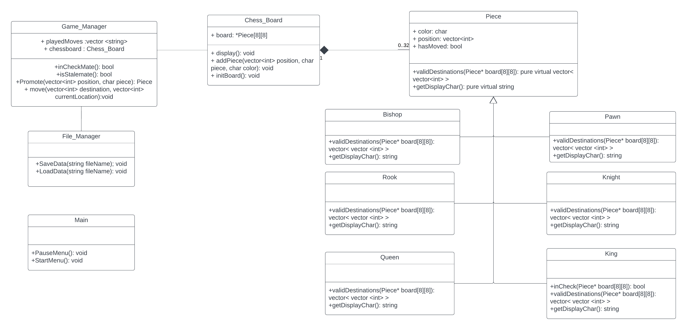

[](https://classroom.github.com/online_ide?assignment_repo_id=10871799&assignment_repo_type=AssignmentRepo)

# Chess
 Authors: 
 * [Rodrigo Maroto Caño](https://github.com/RodrigoMaroto)
 * [Corey Broussard](https://github.com/cbrou002)
 * [Tristan Dull](https://github.com/Tristancd1)
 * [Peter Natividad](https://github.com/Pnati002)
 

## Project Description
We will be designing and building a terminal-based chess game with two players. This project is important and interesting to us because it is a cool game and we think we’d have a relatively good time doing this over other ideas. We plan to keep the chess game, including all input and output, inside the terminal using C++.  
The user inputs will be in the format of pairs of coordinates of the board (ex. A6 to A7). The initial output would be the board when no moves were made, whose turn it is, and a prompt for the player to make their move. Output would be the chess board after the move was made.  
Some features that should be implemented in the project are:  
* 2 player game
* Fully functioning chess board
* Possibility of saving and reloading games
* Ability to move chess pieces in legal ways
* Ability to determine if a king is in checkmate
* Ability to detect other game-ending states like stalemate.
* Ability to promote a pawn when the conditions match
* Checks to see if the chess piece is in the boundaries of the board.
* Possibility to revert moves


## User Interface Specification
 

### Navigation Diagram

The start menu is the first menu seen and the next menus you can see are indicated by the arrows in the diagram. The text boxes near the lines represent the inputs needed to get to those screens.

### Screen Layouts
Start Menu:
```text
Welcome to Chess!

Would you like to load a previous game or start a new game?
(Type ‘L’ to load game, ‘N’ for a new game): 
```
Load menu:
```text
What is the file name your game is stored in?
Enter file name:  
```
This file contains the previous moves played as well as the current state of the board. Once the file is inputted the game starts and takes the inputs from the file until there is none left. Essentially replaying the game until the most recent turn.  

Game Display:   
    
```text
White’s turn (Input the location [column, row] of the piece you want to move, then where you want to put it i.e. C8 D7  )  (If you want to pause the game, input “pause” which sends you to a menu):
Input move:

*white’s move is computed then displays the current state of the board after the turn*

Black’s turn (name the location  [column, row] of the piece you want to move, then where you want to put it) (If you want to pause the game, input “pause” which sends you to a menu):
Input move: 
```
(Note: If move was invalid)
```text
Move was invalid, input new move:  
```
Pause menu
```text
input: “surrender” to forfeit and end the game, “back” to go back to the game, or “save” to save the current state of the match along with the previous moves played:


(if inputs “save”)
Please input the name of the file to save the data in: 
```
End-game menu
```text
White/Black Wins!  
```


## Class Diagram
 
 The piece class is going to be used as an abstract class, with each type of piece inheriting from the piece class. Each type of piece will inherit a color and position, and override the move() and validDestinations() functions according to the piece to be moved. The pawn, rook, and king will have a ‘hasMoved’ boolean variable which will be checked when attempting to castle or move two spaces as a pawn. The color of each piece will be either black or white. The validDestinations() function for a specific piece stores a vector of integers which represents destinations that that piece could move to in one move. 

The Game_Manager class is used to store the previous moves and the board. It is also used to perform functions for certain cases such as check, stalemate, and checkmate. This class also is used for pawn promotions, and saving or loading previous games. It is associated with the Chess_Board class because it cannot do any of its functions without a chess board, and the chess board is useless without the game manager. 

The Chess_Board class serves as the storage area for the chess pieces and represents all the spaces in a chess board. It is composed of an array of Piece pointers (array size of 64 to represent every space on a normal chess board). Each slot will either be null (empty space) or have a piece pointer towards a specific chess piece (Rook, Knight, etc…). It also displays the current state of the board with the display function.

 
 > ## Phase III
 > You will need to schedule a check-in for the second scrum meeting with the same reader you had your first scrum meeting with (using Calendly). Your entire team must be present. This meeting will occur on week 8 during lab time.
 
 > BEFORE the meeting you should do the following:
 > * Update your class diagram from Phase II to include any feedback you received from your TA/grader.
 > * Considering the SOLID design principles, reflect back on your class diagram and think about how you can use the SOLID principles to improve your design. You should then update the README.md file by adding the following:
 >   * A new class diagram incorporating your changes after considering the SOLID principles.
 >   * For each update in your class diagram, you must explain in 3-4 sentences:
 >     * What SOLID principle(s) did you apply?
 >     * How did you apply it? i.e. describe the change.
 >     * How did this change help you write better code?
 > * Perform a new sprint plan like you did in Phase II.
 > * You should also make sure that your README file (and Project board) are up-to-date reflecting the current status of your project and the most recent class diagram. Previous versions of the README file should still be visible through your commit history.
 
> During the meeting with your reader you will discuss: 
 > * How effective your last sprint was (each member should talk about what they did)
 > * Any tasks that did not get completed last sprint, and how you took them into consideration for this sprint
 > * Any bugs you've identified and created issues for during the sprint. Do you plan on fixing them in the next sprint or are they lower priority?
 > * What tasks you are planning for this next sprint.

 
 > ## Final deliverable
 > All group members will give a demo to the reader during lab time. ou should schedule your demo on Calendly with the same reader who took your second scrum meeting. The reader will check the demo and the project GitHub repository and ask a few questions to all the team members. 
 > Before the demo, you should do the following:
 > * Complete the sections below (i.e. Screenshots, Installation/Usage, Testing)
 > * Plan one more sprint (that you will not necessarily complete before the end of the quarter). Your In-progress and In-testing columns should be empty (you are not doing more work currently) but your TODO column should have a full sprint plan in it as you have done before. This should include any known bugs (there should be some) or new features you would like to add. These should appear as issues/cards on your Project board.
 > * Make sure your README file and Project board are up-to-date reflecting the current status of your project (e.g. any changes that you have made during the project such as changes to your class diagram). Previous versions should still be visible through your commit history. 
 
 ## Screenshots
 > Screenshots of the input/output after running your application
 ## Installation/Usage
 > Instructions on installing and running your application
 ## Testing
 > How was your project tested/validated? If you used CI, you should have a "build passing" badge in this README.
 
